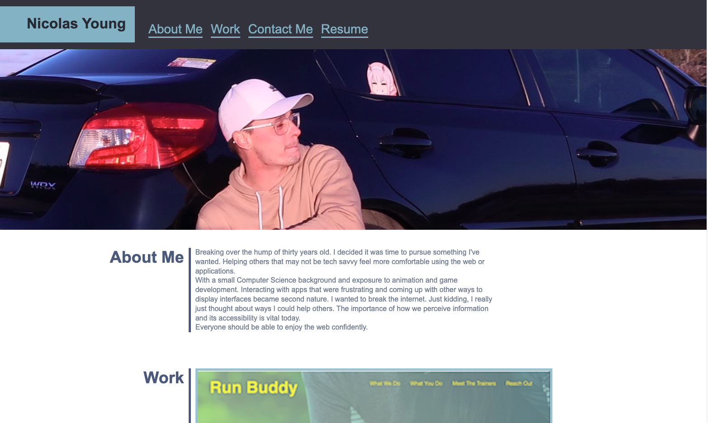
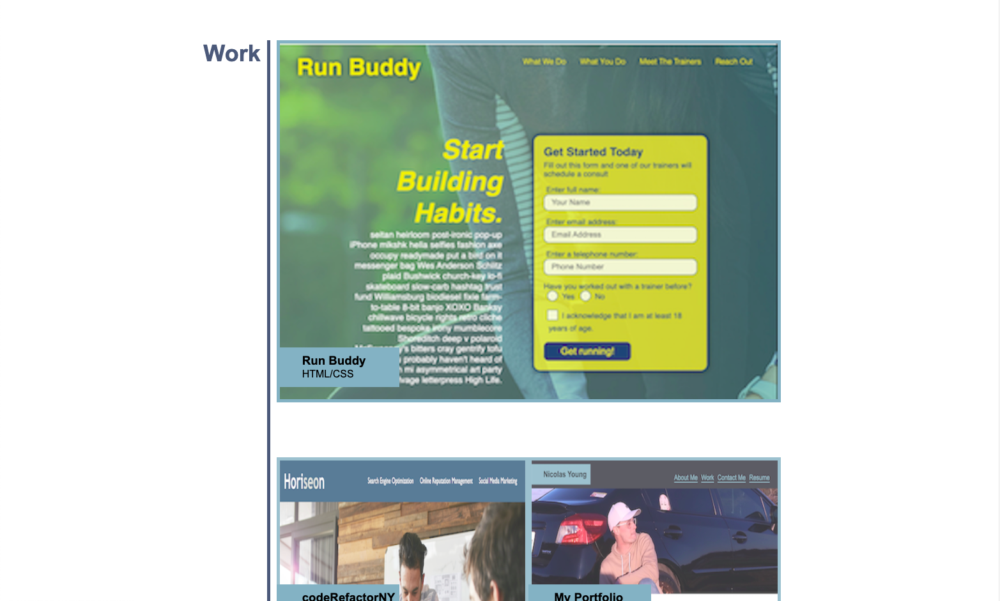
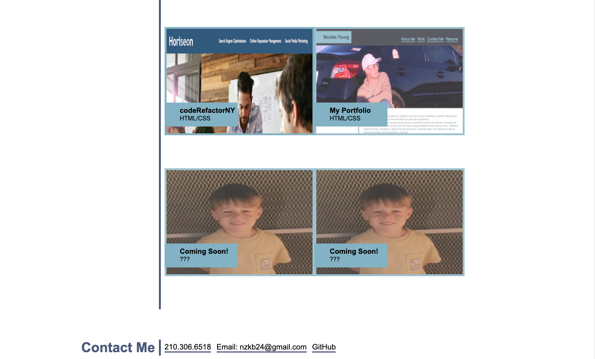
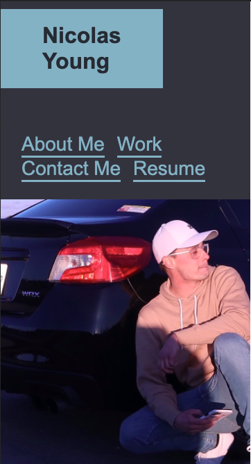
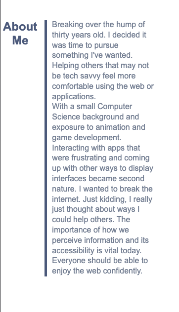
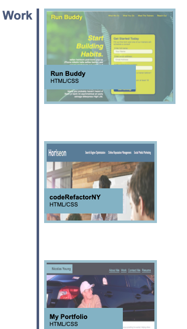
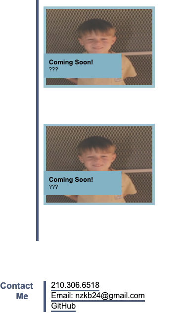

# **AboutMeNY My Personal Portfolio Page**

## [aboutMeNY Website](https://maddnty.github.io/aboutMeNY)

## **This page highlights my very own work!**
> As my journey continues as a developer I will continue to update this page
> with new projects and different style.

### **Build Status**
> This page is updated for media responsiveness.
> This page highlights my work, links to my resume and has a contact me section 
> where I can be reached via phone, email or git.
> This page was styled based on the mock up and still needs some improvement.
> I couldn't resist trying to emulate the same page. I welcomed the challenge!

#### **Screenshots**

